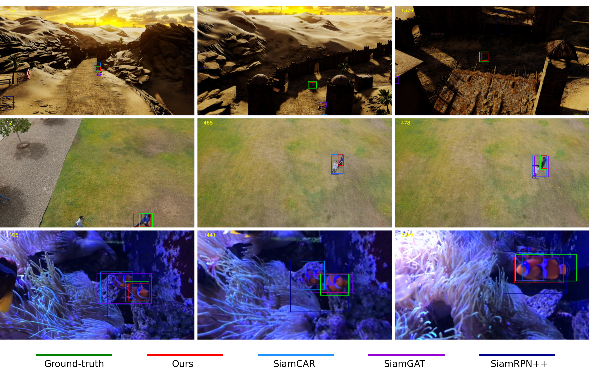
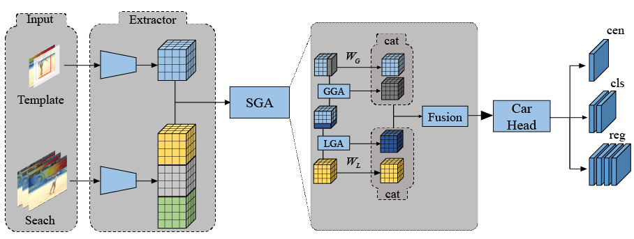

# SiamSGA
<div align="center">
  
  <p>Comparisons with SiamGAT, SiamCar and SiamRPN++.</p>
</div>
We propose symmetric graph attention network for visual tracking, which learns how to capture global and local information as much as possible. Our SiamSGA construct part-to-part and integral-to-integral connection between feature maps to encode more useful information passing from two branches. We conduct experiments on five popular benchmarks including LaSOT, UAV123, NFS30, OTB100 and NFS240. Experimental results indicate that our tracker SiamSGA outperform many state-of-the-art trackers.

<div align="center">
  
  <p>Architecture of our approach.</p>
</div>

## 1. Environment setup
This code has been tested on Ubuntu 18.04, Python 3.7, Pytorch 1.7.0, CUDA 10.1.
Please install related libraries before running this code: 
```bash
pip install -r requirements.txt
```

## 2. Test
<table>
    <tr>
        <td colspan="2" align=center> Dataset</td>
        <td align=center>SiamSGA</td>
    </tr>
    <tr>
        <td rowspan="2" align=center>OTB100</td>
        <td>Success</td>
        <td>69.5</td>
    </tr>
    <tr>
        <td>Precision</td>
        <td>90.5</td>
    </tr>
    <tr>
        <td rowspan="2" align=center>UAV123</td>
        <td>Success</td>
        <td>63.7</td>
    </tr>
    <tr>
        <td>Precision</td>
        <td>83.4</td>
    </tr>
    <tr>
        <td rowspan="3" align=center>LaSOT</td>
        <td>Success</td>
        <td>55.2</td>
    </tr>
    <tr>
        <td>Norm precision</td>
        <td>64.9</td>
    </tr>
    <tr>
        <td>Precision</td>
        <td>56.3</td>
    </tr>
    <tr>
        <td rowspan="2" align=center>NFS30</td>
        <td>Success</td>
        <td>63.4</td>
    </tr>
    <tr>
        <td>Precision</td>
        <td>76.4</td>
    </tr>
        <tr>
        <td rowspan="3" align=center>NFS240</td>
        <td>Success</td>
        <td>63,9</td>
    </tr>
    <tr>
        <td>Precision</td>
        <td>78.9</td>
    </tr>
</table>

Download the general pretrained model:
[SiamSGA.pth](https://drive.google.com/file/d/1D5GDhdzVT_JFL7Nif6wwvdFHiB8nS7fb/view?usp=drive_link)

```bash 
python testTracker.py \    
        --config ../experiments/Siam_SGA/config.yaml \
	--dataset UAV123 \                                 # LaSOT, NFS240, OTB100
	--snapshot "Your_path"/snapshot/Siam_SGA.pth       # tracker_name
```
The testing result will be saved in the `results/"dataset_name"/SiamSGA` directory.

## 3. Train

### Prepare training datasets

Download the datasets：
* [VID](http://image-net.org/challenges/LSVRC/2017/)
* [DET](http://image-net.org/challenges/LSVRC/2017/)
* [COCO](http://cocodataset.org)
* [GOT-10K](http://got-10k.aitestunion.com/downloads)
* [LaSOT](https://cis.temple.edu/lasot/)
* [TrackingNet](https://tracking-net.org/#downloads)

All of relative datasets, including originate datasets and cropped datasets, are available [here](https://blog.csdn.net/Soonki/article/details/134498704?spm=1001.2014.3001.5502)


**Note:** `training_dataset/dataset_name/readme.md` has listed detailed operations about how to generate training datasets.

### Download pretrained backbone
Download pretrained backbone from [link](https://download.pytorch.org/models/inception_v3_google-1a9a5a14.pth) and put them into `pretrained_models` directory.

### Train a model
To train the SiamGAT model, run `train.py` with the desired configs:

```bash
cd tools
python train.py
```

## 4. Evaluation
We provide the tracking [results](https://drive.google.com/file/d/1iifBJlEtTBA9Mh4B2WhZnN4G5CcnGEcB/view?usp=drive_link) of NFS30, NFS240, LaSOT, OTB100 and UAV123  on google drive. If you want to evaluate the tracker on OTB100, UAV123, NFS30, NFS240 and LaSOT, please put those results into  `results/"dataset_name"` directory.  

```
python eval.py 	                          \
	--tracker_path ./results          \ # result path
	--dataset UAV123                  \ # dataset_name
	--tracker_prefix 'bike1'   # tracker_name \sequence name
```

## 5. Acknowledgement
The code is implemented based on [SiamGAT](https://git.io/SiamGAT) and [SiamCAR](https://github.com/ohhhyeahhh/SiamCAR). We would like to express our sincere thanks to the contributors.

